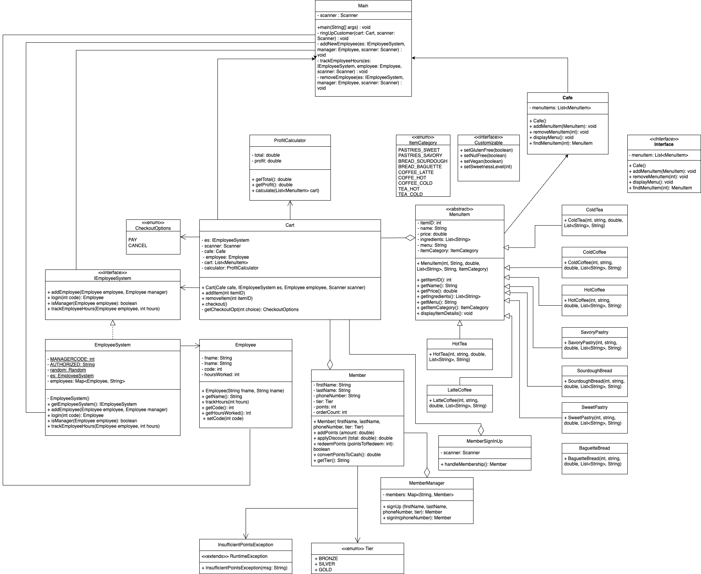

# Cafe Management System 

## Overview
The Cafe Management System is a software application that automates and ensures the accuracy of cafe operations, handles menu items, accepts client orders, evaluates employee work hours, and manages membership benefits.

## UML Diagram


## Features 

### Menu Item Categories

* Pastries (Sweet, Savory)
* Bread (Sourdough, Baguette)
* Coffee (Latte, Hot, Cold)
* Tea (Hot, Cold)

### Interfaces

* **Customizable**: Customers may customize the items they buy according on allergies, sweetness levels, gluten free choices, and dietary limitations.
* **Maintainable**: Use to tracks applicance use and recommends repair after a certain number of uses to avoid machine failure.

### Membership System
* **Levels**: Guest (Defaults), Bronze (Free), Silver ($5 per month), Guest ($15 per month)
* **Rewards**: Points discounts according to membership level.
* **Membership Authorization**: Manages sign-up, sign-in, and benefits.

## How to Run
- Java JDK 8 or later
- An IDE like IntelliJ IDEA or Eclipse
- Clone repository 
- Open repository in your preferred IDE
- Complie and Run Main.java
- When starting up, the system will ask for a code, enter the employee access code 151
- Follow the prompts that pop up after entering the access code
- If you would like to shut down the program type EXIT in all caps

Run the program without running test:
```
$ javac -d out $(find src -name "*.java" ! -path "src/test/*")
$ java -cp out Main   
```